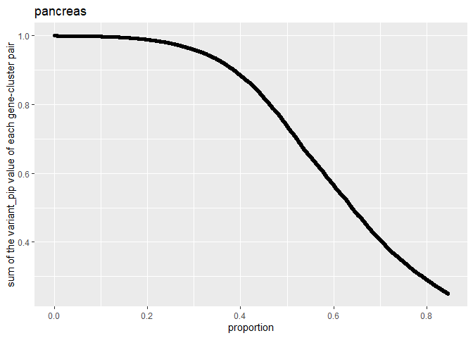
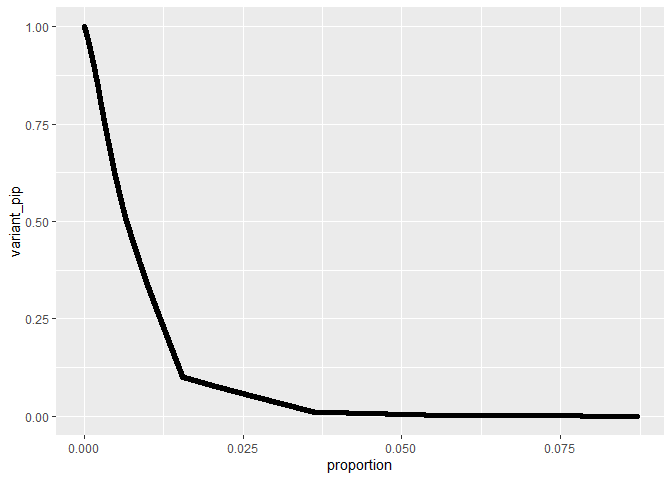
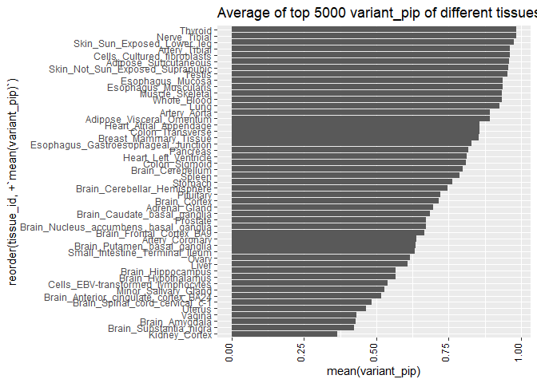

# Read in the data from GETx project ([data is from Dr.William Wen’s paper](https://gtexportal.org/home/datasets)).

    library(tidyverse)
    library(dplyr)
    library(data.table)

    setwd("D:/Charles_coursework/PME/Rotation/Haky_lab/singleXcan/singleXcan_project/GTEx_v8_finemapping_DAPG/")
    getwd()

    ## [1] "D:/Charles_coursework/PME/Rotation/Haky_lab/singleXcan/singleXcan_project/GTEx_v8_finemapping_DAPG"

    original <- read_table("GTEx_v8_finemapping_DAPG.txt")

    tissue <- unique(original$tissue_id)
    length(tissue)

    ## [1] 49

    vcf3 <- fread("GTEx_v8_finemapping_DAPG.vcf")
    CS95 <- read_table("GTEx_v8_finemapping_DAPG.CS95.txt")

    head(CS95)

    ## # A tibble: 6 x 6
    ##     `1` `100000723` chr1_100000723_G_A_b38 G     A     `ENSG00000117620.14:1@S~`
    ##   <dbl>       <dbl> <chr>                  <chr> <chr> <chr>                    
    ## 1     1   100001396 chr1_100001396_G_C_b38 G     C     ENSG00000137996.12:1@Cel~
    ## 2     1   100002416 chr1_100002416_C_T_b38 C     T     ENSG00000156875.13:1@Tes~
    ## 3     1   100003060 chr1_100003060_C_T_b38 C     T     ENSG00000122477.12:1@Ute~
    ## 4     1   100003083 chr1_100003083_G_T_b38 G     T     ENSG00000156875.13:1@Tes~
    ## 5     1    10000458 chr1_10000458_T_C_b38  T     C     ENSG00000173614.13:1@Cel~
    ## 6     1   100004881 chr1_100004881_A_G_b38 A     G     ENSG00000137996.12:1@Cel~

    head(original)

    ## # A tibble: 6 x 6
    ##   tissue_id            gene_id     cluster_id cluster_pip variant_id variant_pip
    ##   <chr>                <chr>            <dbl>       <dbl> <chr>            <dbl>
    ## 1 Adipose_Subcutaneous ENSG000000~          1       1     chr1_1698~      0.988 
    ## 2 Adipose_Subcutaneous ENSG000000~          1       1     chr1_1699~      0.0117
    ## 3 Adipose_Subcutaneous ENSG000000~          2       0.994 chr1_1698~      0.121 
    ## 4 Adipose_Subcutaneous ENSG000000~          2       0.994 chr1_1698~      0.0883
    ## 5 Adipose_Subcutaneous ENSG000000~          2       0.994 chr1_1698~      0.0242
    ## 6 Adipose_Subcutaneous ENSG000000~          2       0.994 chr1_1698~      0.0242

    head(vcf3)

    ##      V1    V2                 V3 V4 V5
    ## 1: chr1 14677 chr1_14677_G_A_b38  G  A
    ## 2: chr1 16841 chr1_16841_G_T_b38  G  T
    ## 3: chr1 54421 chr1_54421_A_G_b38  A  G
    ## 4: chr1 54490 chr1_54490_G_A_b38  G  A
    ## 5: chr1 58814 chr1_58814_G_A_b38  G  A
    ## 6: chr1 60351 chr1_60351_A_G_b38  A  G
    ##                                                                                                                                                                                                                                                                                                                                                                                                                                                                                                                                                                                                                                                                                                                                                                                                                                                                                                                                                                                                                                                                                                                                                                                                                                                                                                                                                                                                                                                                                                                                                                                                                                                                                                                                                                                                                                                                                                                                                                                                                                                                                                                                                                                                                                                                                                                                                                                                                                                                                                                                                                                                                                                                                                                                                                                                                                                                                                                                                                                                                                                                                                                                                                                                                                                                                                                                                                                                                                                                                                                                                                                                                                                                                                                                                                                                                                                                                                                                                                                                                                                                                                                                                           V6
    ## 1: ENSG00000228463:2@Skin_Not_Sun_Exposed=1.00000e+00[1.000e+00:1]|ENSG00000228463:1@Adipose_Visceral_Omentum=1.00000e+00[1.000e+00:1]|ENSG00000228463:2@Nerve_Tibial=1.00000e+00[1.000e+00:1]|ENSG00000228463:2@Muscle_Skeletal=1.00000e+00[1.000e+00:1]|ENSG00000228463:2@Skin_Sun_Exposed=9.99998e-01[1.000e+00:1]|ENSG00000228463:1@Heart_Left_Ventricle=9.99995e-01[1.000e+00:1]|ENSG00000228463:1@Heart_Atrial_Appendage=9.99990e-01[1.000e+00:1]|ENSG00000241860:1@Skin_Sun_Exposed=9.99986e-01[1.000e+00:1]|ENSG00000241860:1@Skin_Not_Sun_Exposed=9.99983e-01[1.000e+00:1]|ENSG00000228327:1@Muscle_Skeletal=9.99942e-01[9.999e-01:1]|ENSG00000241860:1@Nerve_Tibial=9.99938e-01[9.999e-01:1]|ENSG00000228327:1@Adipose_Visceral_Omentum=9.99918e-01[9.999e-01:1]|ENSG00000228327:2@Adipose_Subcutaneous=9.99918e-01[9.999e-01:1]|ENSG00000228327:1@Heart_Atrial_Appendage=9.99866e-01[9.999e-01:1]|ENSG00000228327:2@Lung=9.99832e-01[9.998e-01:1]|ENSG00000241860:1@Artery_Tibial=9.99822e-01[9.998e-01:1]|ENSG00000228327:2@Esophagus_Mucosa=9.99765e-01[9.998e-01:1]|ENSG00000228327:2@Thyroid=9.99553e-01[9.996e-01:1]|ENSG00000228327:2@Artery_Aorta=9.99418e-01[9.994e-01:1]|ENSG00000228327:2@Nerve_Tibial=9.99226e-01[9.992e-01:1]|ENSG00000228327:2@Skin_Sun_Exposed=9.99023e-01[9.990e-01:1]|ENSG00000228327:2@Skin_Not_Sun_Exposed=9.98909e-01[9.989e-01:1]|ENSG00000228327:1@Cells_Cultured_fibroblasts=9.98896e-01[9.989e-01:1]|ENSG00000228327:3@Artery_Tibial=9.98812e-01[9.988e-01:1]|ENSG00000241860:1@Adipose_Visceral_Omentum=9.98112e-01[9.981e-01:1]|ENSG00000241860:1@Esophagus_Muscularis=9.97358e-01[9.974e-01:1]|ENSG00000228327:2@Colon_Transverse=9.94829e-01[9.948e-01:1]|ENSG00000228327:1@Heart_Left_Ventricle=9.92955e-01[9.930e-01:1]|ENSG00000241860:1@Thyroid=9.84336e-01[9.843e-01:1]|ENSG00000241860:1@Cells_Cultured_fibroblasts=9.81095e-01[9.811e-01:1]|ENSG00000228463:4@Adipose_Subcutaneous=9.70763e-01[9.708e-01:1]|ENSG00000228327:2@Spleen=9.22751e-01[9.228e-01:1]|ENSG00000228327:1@Brain_Cortex=9.16290e-01[9.163e-01:1]|ENSG00000241860:1@Heart_Atrial_Appendage=8.94191e-01[8.942e-01:1]|ENSG00000241860:1@Brain_Nucleus_accumbens_basal_ganglia=6.26400e-01[6.264e-01:1]|ENSG00000228327:1@Pituitary=4.97094e-01[4.971e-01:1]|ENSG00000241860:1@Adipose_Subcutaneous=4.87540e-01[4.875e-01:1]|ENSG00000228463:4@Thyroid=4.71732e-01[4.717e-01:1]|ENSG00000241860:1@Lung=3.55037e-01[3.550e-01:1]|ENSG00000228463:4@Cells_Cultured_fibroblasts=3.26212e-01[3.262e-01:1]|ENSG00000228327:1@Brain_Nucleus_accumbens_basal_ganglia=2.89177e-01[2.892e-01:1]|ENSG00000228327:1@Brain_Frontal_Cortex_BA9=2.80233e-01[2.802e-01:1]|ENSG00000241860:1@Esophagus_Gastroesophageal_Junction=1.89675e-01[1.897e-01:1]|ENSG00000241860:1@Colon_Transverse=1.59617e-01[1.596e-01:1]|ENSG00000241860:1@Brain_Cortex=1.49429e-01[1.494e-01:1]|ENSG00000228327:3@Esophagus_Gastroesophageal_Junction=1.48368e-01[1.484e-01:1]|ENSG00000241860:1@Artery_Aorta=1.48320e-01[1.483e-01:1]|ENSG00000228327:1@Brain_Hypothalamus=1.46787e-01[1.468e-01:1]|ENSG00000228463:1@Liver=1.21183e-01[1.212e-01:1]|ENSG00000241860:1@Colon_Sigmoid=1.02836e-01[1.028e-01:1]|ENSG00000228327:1@Brain_Cerebellum=7.46281e-02[7.463e-02:1]|ENSG00000228327:2@Breast_Mammary_Tissue=7.09307e-02[7.093e-02:1]|ENSG00000228463:3@Esophagus_Muscularis=6.48767e-02[6.488e-02:1]|ENSG00000241860:1@Brain_Frontal_Cortex_BA9=5.98753e-02[5.988e-02:1]|ENSG00000228463:4@Artery_Tibial=5.21028e-02[5.210e-02:1]|ENSG00000228327:2@Stomach=4.94393e-02[4.944e-02:1]|ENSG00000241860:1@Breast_Mammary_Tissue=2.57222e-02[2.572e-02:1]|ENSG00000228327:3@Brain_Caudate_basal_ganglia=2.40533e-02[2.405e-02:1]|ENSG00000228327:2@Brain_Cerebellar_Hemisphere=1.64635e-02[1.646e-02:1]|ENSG00000228327:3@Liver=8.33695e-03[8.337e-03:1]|ENSG00000228327:4@Esophagus_Muscularis=5.40751e-03[5.408e-03:1]|ENSG00000241860:1@Prostate=3.34826e-03[3.348e-03:1]|ENSG00000228327:5@Colon_Sigmoid=2.72283e-03[2.723e-03:1]|ENSG00000241860:1@Liver=1.98615e-03[1.986e-03:1]|ENSG00000241860:1@Brain_Caudate_basal_ganglia=1.53346e-03[1.533e-03:1]
    ## 2:                                                                                                                                                                                                                                                                                                                                                                                                                                                                                                                                                                                                                                                                                                                                                                                                                                                                                                                                                                                                                                                                                                                                                                                                                                                                                                                                                                                                                                                                                                                                                                                                                                                                                                                                                                                                                                                                                                                                                                                                                                                                                                                                                                                                                                                                                                                                                                                                                                                                                                                                                                                                                                                                                                                                                                                                                                                                                                                                               ENSG00000227232:2@Esophagus_Mucosa=2.42919e-02[2.429e-02:1]|ENSG00000227232:2@Small_Intestine_Terminal_Ileum=1.79413e-02[1.794e-02:1]|ENSG00000223972:2@Testis=1.30519e-02[1.305e-02:1]|ENSG00000279457:2@Nerve_Tibial=7.19017e-03[7.190e-03:1]|ENSG00000279457:2@Esophagus_Muscularis=3.55600e-03[3.556e-03:1]|ENSG00000227232:1@Prostate=3.10046e-03[3.100e-03:1]|ENSG00000227232:2@Spleen=2.48977e-03[2.490e-03:1]|ENSG00000227232:2@Esophagus_Muscularis=2.44974e-03[2.450e-03:1]|ENSG00000227232:2@Brain_Cortex=1.98603e-03[1.986e-03:1]|ENSG00000227232:2@Cells_EBV-transformed_lymphocytes=9.62482e-04[9.625e-04:1]|ENSG00000227232:1@Brain_Caudate_basal_ganglia=9.60708e-04[9.607e-04:1]|ENSG00000227232:2@Brain_Cerebellar_Hemisphere=6.73695e-04[6.737e-04:1]|ENSG00000227232:2@Skin_Not_Sun_Exposed=5.43204e-04[5.432e-04:1]|ENSG00000227232:2@Vagina=5.33130e-04[5.331e-04:1]|ENSG00000227232:2@Minor_Salivary_Gland=5.32466e-04[5.325e-04:1]|ENSG00000227232:2@Brain_Substantia_nigra=5.22466e-04[5.225e-04:1]|ENSG00000227232:2@Brain_Spinal_cord_cervical_c-1=5.16712e-04[5.167e-04:1]|ENSG00000227232:2@Testis=4.38369e-04[4.384e-04:1]|ENSG00000227232:4@Thyroid=2.83804e-04[2.838e-04:1]
    ## 3:                                                                                                                                                                                                                                                                                                                                                                                                                                                                                                                                                                                                                                                                                                                                                                                                                                                                                                                                                                                                                                                                                                                                                                                                                                                                                                                                                                                                                                                                                                                                                                                                                                                                                                                                                                                                                                                                                                                                                                                                                  ENSG00000279457:1@Esophagus_Muscularis=5.92456e-03[9.570e-03:2]|ENSG00000227232:2@Esophagus_Gastroesophageal_Junction=4.08081e-03[4.481e-03:2]|ENSG00000227232:2@Adipose_Subcutaneous=3.10733e-03[3.787e-03:2]|ENSG00000227232:2@Brain_Anterior_cingulate_cortex_BA24=2.64614e-03[3.712e-03:3]|ENSG00000227232:2@Brain_Putamen_basal_ganglia=2.34431e-03[2.728e-03:3]|ENSG00000227232:1@Brain_Nucleus_accumbens_basal_ganglia=2.21835e-03[2.884e-03:3]|ENSG00000227232:2@Stomach=2.17532e-03[2.299e-03:2]|ENSG00000227232:1@Brain_Cerebellar_Hemisphere=1.48762e-03[1.946e-03:3]|ENSG00000240361:1@Heart_Left_Ventricle=1.39808e-03[1.555e-02:2]|ENSG00000227232:3@Adipose_Visceral_Omentum=1.19049e-03[2.768e-03:2]|ENSG00000227232:2@Ovary=1.11753e-03[1.118e-03:1]|ENSG00000240361:1@Brain_Amygdala=1.05491e-03[1.466e-02:2]|ENSG00000279457:2@Whole_Blood=9.92484e-04[4.953e-03:4]|ENSG00000186092:2@Brain_Frontal_Cortex_BA9=9.62934e-04[3.193e-03:3]|ENSG00000227232:1@Brain_Hippocampus=8.94319e-04[1.302e-03:3]|ENSG00000227232:2@Artery_Coronary=8.09042e-04[1.284e-03:2]|ENSG00000227232:1@Brain_Spinal_cord_cervical_c-1=7.41958e-04[9.796e-04:2]|ENSG00000227232:1@Brain_Frontal_Cortex_BA9=7.33487e-04[1.085e-03:3]|ENSG00000227232:2@Muscle_Skeletal=6.99183e-04[1.204e-03:2]|ENSG00000227232:2@Heart_Left_Ventricle=6.18743e-04[8.597e-04:2]|ENSG00000227232:2@Brain_Amygdala=6.02512e-04[8.268e-04:3]|ENSG00000186092:2@Brain_Substantia_nigra=5.99880e-04[2.512e-03:3]|ENSG00000186092:2@Brain_Nucleus_accumbens_basal_ganglia=5.97710e-04[1.933e-03:2]|ENSG00000227232:2@Kidney_Cortex=5.77720e-04[8.688e-04:3]|ENSG00000227232:2@Adrenal_Gland=5.46197e-04[7.862e-04:2]|ENSG00000227232:3@Whole_Blood=4.45103e-04[5.183e-04:4]|ENSG00000227232:3@Uterus=3.99648e-04[3.996e-04:1]|ENSG00000279457:1@Heart_Left_Ventricle=3.62748e-04[4.055e-03:2]|ENSG00000279457:1@Esophagus_Mucosa=3.47952e-04[2.621e-03:2]|ENSG00000279457:2@Esophagus_Gastroesophageal_Junction=3.11443e-04[1.833e-03:2]|ENSG00000279457:3@Artery_Tibial=2.78384e-04[8.884e-04:2]|ENSG00000227232:3@Breast_Mammary_Tissue=1.40039e-04[2.174e-04:2]
    ## 4:                                                                                                                                                                                                                                                                                                                                                                                                                                                                                                                                                                                                                                                                                                                                                                                                                                                                                                                                                                                                                                                                                                                                                                                                                                                                                                                                                                                                                                                                                                                                                                                                                                                                                                                                                                                                                                                                                                                                                                                                                                                                                                                                                                                                                                                                                                                                                                                                                                                                                                                                                                                                                                                                                                                                                                                                                                                                                                                                                                                                                                                                                                                                                                                    ENSG00000269981:2@Testis=9.99949e-01[9.999e-01:1]|ENSG00000238009:2@Testis=9.99848e-01[9.998e-01:1]|ENSG00000268903:2@Testis=9.99732e-01[9.997e-01:1]|ENSG00000227232:2@Thyroid=2.39352e-01[2.394e-01:1]|ENSG00000227232:2@Breast_Mammary_Tissue=5.04131e-02[5.041e-02:1]|ENSG00000269981:1@Brain_Anterior_cingulate_cortex_BA24=1.63134e-02[1.631e-02:1]|ENSG00000239906:2@Testis=1.55930e-02[1.559e-02:1]|ENSG00000227232:3@Small_Intestine_Terminal_Ileum=7.54553e-03[7.546e-03:1]|ENSG00000186092:1@Brain_Putamen_basal_ganglia=4.29199e-03[4.292e-03:1]|ENSG00000227232:2@Artery_Tibial=4.20609e-03[4.206e-03:1]|ENSG00000227232:2@Lung=3.04368e-03[3.044e-03:1]|ENSG00000268903:3@Brain_Cerebellum=2.20502e-03[2.205e-03:1]|ENSG00000227232:2@Skin_Sun_Exposed=1.84384e-03[1.844e-03:1]|ENSG00000269981:3@Brain_Cerebellum=9.39482e-04[9.395e-04:1]|ENSG00000227232:2@Pancreas=7.77825e-04[7.778e-04:1]|ENSG00000227232:1@Kidney_Cortex=5.87517e-04[5.875e-04:1]
    ## 5:                                                                                                                                                                                                                                                                                                                                                                                                                                                                                                                                                                                                                                                                                                                                                                                                                                                                                                                                                                                                                                                                                                                                                                                                                                                                                                                                                                                                                                                                                                                                                                                                                                                                                                                                                                                                                                                                                                                                                                                                                                                                                                                                                                                                                                                                                                                                                                                                                                                                                                                                                                                                                                                                                                                                                                                                                                                                                                                                                                                                                                                                                                                                                                                                                                                            ENSG00000268903:1@Artery_Coronary=4.41761e-03[2.730e-01:5]|ENSG00000227232:1@Brain_Anterior_cingulate_cortex_BA24=3.20968e-03[1.047e-02:5]|ENSG00000227232:2@Brain_Hypothalamus=2.55688e-03[9.544e-03:5]|ENSG00000269981:1@Adrenal_Gland=2.48788e-03[2.543e-01:4]|ENSG00000240361:2@Brain_Amygdala=2.26966e-03[1.777e-02:5]|ENSG00000227232:2@Brain_Nucleus_accumbens_basal_ganglia=2.15385e-03[4.384e-03:5]|ENSG00000268903:1@Adrenal_Gland=1.96773e-03[1.633e-01:4]|ENSG00000227232:1@Brain_Amygdala=1.69084e-03[4.281e-03:5]|ENSG00000186092:1@Brain_Amygdala=1.29524e-03[4.482e-02:5]|ENSG00000186092:2@Brain_Caudate_basal_ganglia=1.18596e-03[4.932e-03:4]|ENSG00000186092:1@Brain_Hypothalamus=4.00307e-04[5.400e-03:5]|ENSG00000186092:2@Brain_Hippocampus=3.18903e-04[3.947e-03:5]|ENSG00000233750:2@Ovary=2.89631e-04[4.195e-02:4]|ENSG00000227232:2@Uterus=2.37506e-04[4.122e-03:3]
    ## 6:                                                                                                                                                                                                                                                                                                                                                                                                                                                                                                                                                                                                                                                                                                                                                                                                                                                                                                                                                                                                                                                                                                                                                                                                                                                                                                                                                                                                                                                                                                                                                                                                                                                                                                                                                                                                                                                                                                                                                                                                                                                                                                                                                                                                                                                                                                                                      ENSG00000268903:1@Colon_Transverse=1.20385e-01[9.503e-01:3]|ENSG00000269981:1@Colon_Transverse=8.67511e-02[9.858e-01:3]|ENSG00000269981:1@Artery_Coronary=8.60877e-02[8.624e-01:3]|ENSG00000268903:1@Artery_Coronary=4.85866e-02[2.730e-01:5]|ENSG00000269981:1@Adrenal_Gland=2.08951e-02[2.543e-01:4]|ENSG00000269981:1@Artery_Aorta=1.17507e-02[6.911e-01:3]|ENSG00000186092:1@Brain_Amygdala=1.03095e-02[4.482e-02:5]|ENSG00000268903:1@Adrenal_Gland=7.25585e-03[1.633e-01:4]|ENSG00000269981:3@Heart_Left_Ventricle=6.63433e-03[3.686e-02:3]|ENSG00000269981:1@Nerve_Tibial=5.71916e-03[2.250e-02:3]|ENSG00000233750:2@Ovary=5.49454e-03[4.195e-02:4]|ENSG00000269981:1@Stomach=3.78734e-03[3.648e-01:3]|ENSG00000268903:2@Colon_Sigmoid=3.45162e-03[8.390e-02:3]|ENSG00000227232:2@Brain_Hypothalamus=3.14994e-03[9.544e-03:5]|ENSG00000227232:1@Brain_Anterior_cingulate_cortex_BA24=3.13373e-03[1.047e-02:5]|ENSG00000227232:2@Uterus=2.86626e-03[4.122e-03:3]|ENSG00000240361:2@Brain_Amygdala=2.49160e-03[1.777e-02:5]|ENSG00000239906:2@Esophagus_Mucosa=1.58465e-03[2.942e-02:3]|ENSG00000186092:2@Brain_Caudate_basal_ganglia=1.30853e-03[4.932e-03:4]|ENSG00000269981:3@Esophagus_Mucosa=1.28658e-03[3.106e-02:3]|ENSG00000186092:1@Brain_Hypothalamus=1.23908e-03[5.400e-03:5]|ENSG00000268903:1@Prostate=1.03756e-03[1.592e-02:3]|ENSG00000268903:3@Esophagus_Mucosa=9.60062e-04[1.113e-02:3]|ENSG00000186092:2@Brain_Hippocampus=8.27328e-04[3.947e-03:5]|ENSG00000227232:2@Brain_Nucleus_accumbens_basal_ganglia=7.22666e-04[4.384e-03:5]|ENSG00000268903:2@Heart_Atrial_Appendage=7.04011e-04[3.095e-02:3]|ENSG00000227232:1@Brain_Amygdala=5.75953e-04[4.281e-03:5]|ENSG00000269981:1@Colon_Sigmoid=2.70880e-04[2.168e-02:3]|ENSG00000269981:3@Adipose_Visceral_Omentum=2.42656e-04[2.252e-02:3]

# Get the prioritized list of the variants

Filter the variant by the cluster pip (posterior inclusion probability)
and variant pip value

    prioritized <- original %>%
      filter(cluster_pip >= 0.8) %>%
      group_by(tissue_id, cluster_id, gene_id) %>%
      arrange(desc(variant_pip), .by_group = TRUE) %>%
      mutate(rank = dense_rank(desc(variant_pip))) %>%
      filter(rank == 1)

    # write.csv(prioritized, file = "prioritized_list.csv")

    head(prioritized)

    ## # A tibble: 6 x 7
    ## # Groups:   tissue_id, cluster_id, gene_id [6]
    ##   tissue_id          gene_id cluster_id cluster_pip variant_id variant_pip  rank
    ##   <chr>              <chr>        <dbl>       <dbl> <chr>            <dbl> <int>
    ## 1 Adipose_Subcutane~ ENSG00~          1       1     chr1_1698~       0.988     1
    ## 2 Adipose_Subcutane~ ENSG00~          1       0.995 chr1_2763~       0.818     1
    ## 3 Adipose_Subcutane~ ENSG00~          1       0.997 chr6_5354~       0.976     1
    ## 4 Adipose_Subcutane~ ENSG00~          1       0.994 chr6_4115~       0.126     1
    ## 5 Adipose_Subcutane~ ENSG00~          1       1     chr1_2441~       0.209     1
    ## 6 Adipose_Subcutane~ ENSG00~          1       0.983 chr1_2441~       0.297     1

# Take a look at some plots drawn from the data

## Variant pip distribution of different tissues within prioiritized data

    pri <- prioritized %>% filter(tissue_id %in% c("Lung","Thyroid", "Testis", "Whole_Blood", "Pancreas")) %>% ungroup()

    pri %>% ggplot(aes(variant_pip)) +
      geom_histogram() + facet_wrap(~tissue_id)

    pri %>% count(gene_id, variant_id) %>% arrange(desc(n))

    ## # A tibble: 89,603 x 3
    ##    gene_id            variant_id                 n
    ##    <chr>              <chr>                  <int>
    ##  1 ENSG00000005156.11 chr17_34980567_G_A_b38     5
    ##  2 ENSG00000006282.20 chr17_50547162_A_C_b38     5
    ##  3 ENSG00000007520.3  chr16_1351844_C_G_b38      5
    ##  4 ENSG00000008128.22 chr1_1689221_G_A_b38       5
    ##  5 ENSG00000008517.16 chr16_3065271_T_C_b38      5
    ##  6 ENSG00000013288.8  chr4_6609511_TG_T_b38      5
    ##  7 ENSG00000038219.12 chr4_13578908_A_G_b38      5
    ##  8 ENSG00000041802.10 chr3_194648850_C_A_b38     5
    ##  9 ENSG00000041802.10 chr3_194648851_C_A_b38     5
    ## 10 ENSG00000044090.8  chr6_43053781_G_A_b38      5
    ## # ... with 89,593 more rows

## Information about variant\_pip value distribution within a tissue (pancreas as an example)

Take a look at the sum of the variant\_pip value of each gene-cluster
pair in pancreas as an example

    pancreas <- original %>%
      filter(tissue_id == "Pancreas")
      
    pancreas_modi <- pancreas %>%
      group_by(cluster_id, gene_id) %>%
      # group_by(cluster_id) %>%
      # arrange(desc(variant_pip), .by_group = TRUE) %>%
      summarise(sum(variant_pip), .groups = "rowwise") %>%
      arrange(desc(`sum(variant_pip)`), .by_group = TRUE)

    pancreas_modi <- pancreas_modi %>%
      mutate(rank = dense_rank(desc(`sum(variant_pip)`))/length(pancreas_modi$gene_id)) %>%
      ungroup()

    pancreas_modi <- pancreas_modi %>%
      mutate(rank = dense_rank(desc(`sum(variant_pip)`))/length(pancreas_modi$gene_id)) %>%
      ungroup()

    ggplot(data = pancreas_modi) +
      geom_point(mapping = aes(x = rank , y = `sum(variant_pip)`) ) +
      xlab("proportion")+
      ylab("sum of the variant_pip value of each gene-cluster pair")+
      ggtitle("pancreas")

Take pancreas tissue as an example to look at the variant\_pit
distribution:

    pancreas <- pancreas %>%
      # group_by(cluster_id, gene_id) %>%
      # group_by(cluster_id) %>%
      # arrange(desc(variant_pip), .by_group = TRUE) %>%
      mutate(proportion = dense_rank(desc(variant_pip))/length(pancreas$gene_id)) %>%
      ungroup()
      

    ggplot(data = pancreas) +
      geom_point(mapping = aes(x = proportion , y = variant_pip)) 

    ggplot(data = pancreas) +
      geom_histogram(mapping = aes(x = variant_pip, y = stat(count/sum(count))))

## Max variant\_pip value of different tissues

The top 5000 variant\_pip values of each tissue are averaged (if the
number of the samples chosen from each sample is too small, the average
variant\_pip should be all closed to 1). Then the tissues are sorted by
the descent order of average top 5000 variant\_pip value.

    tissue_sample <- original %>%
      group_by(tissue_id) %>%
      arrange(desc(variant_pip), .by_group = TRUE) %>%
      top_n(5000) %>%
      summarise(mean(variant_pip)) %>%
      arrange(desc(`mean(variant_pip)`), .by_group = TRUE)

    tissue_plot <- ggplot(data = tissue_sample) +
      geom_col(mapping = aes(x = reorder(tissue_id, + `mean(variant_pip)`), y = `mean(variant_pip)`))+
      theme(axis.text.x = element_text(angle = 90, vjust = 0, hjust= 0, color = 'Black'))+
      coord_flip()+
      ggtitle("Average of top 5000 variant_pip of different tissues")

    tissue_plot

